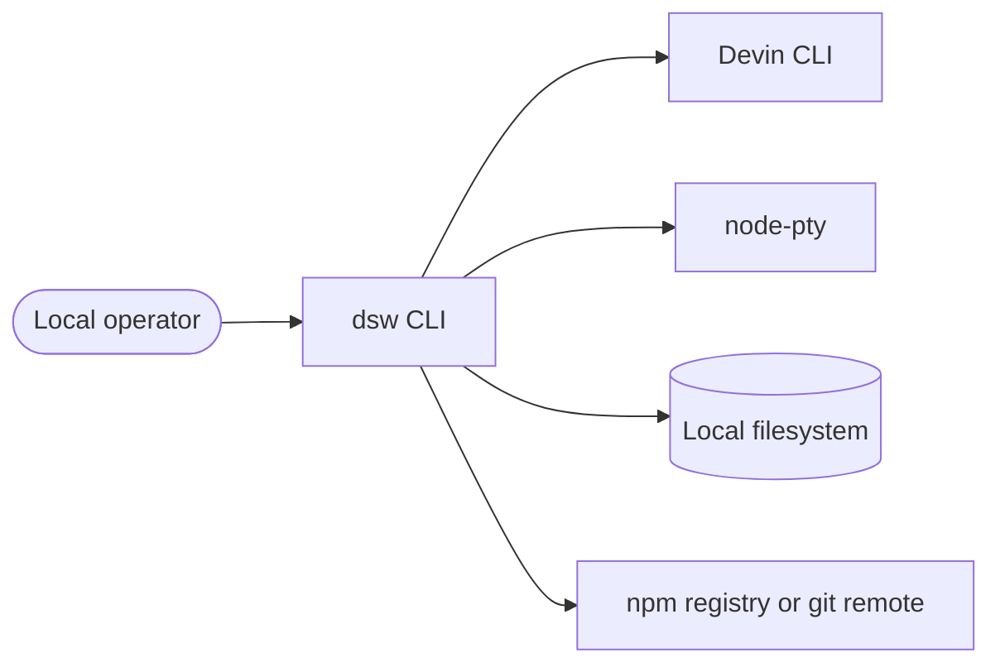
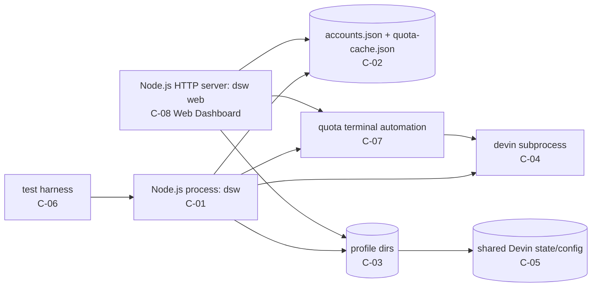
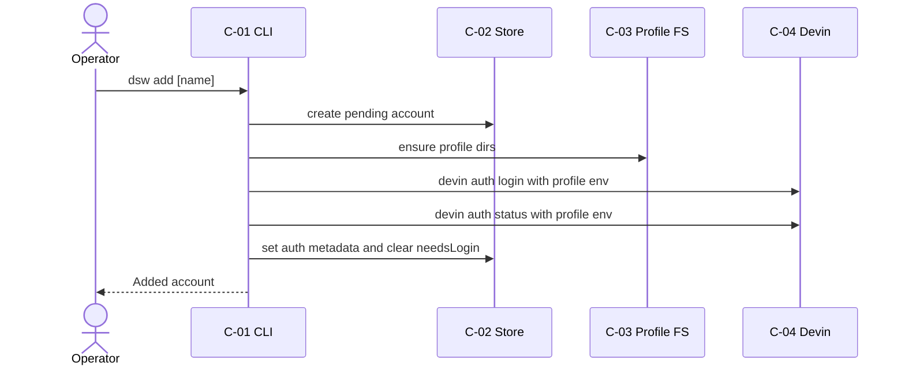
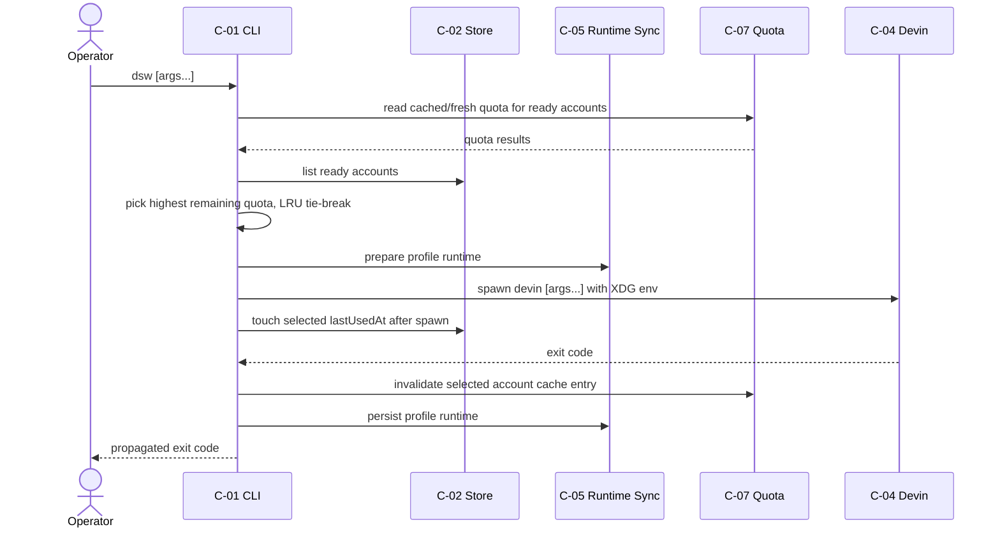
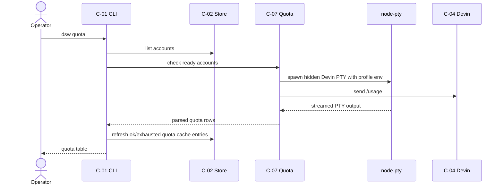
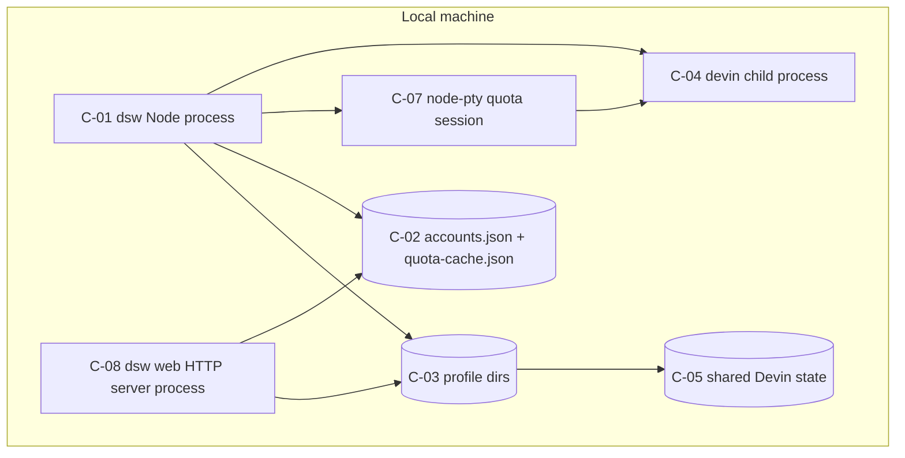

# Architecture - devin-switcher

**Version:** 1.5.0
**Date:** 2026-05-09
**Status:** Active
**Source:** PRD v1.6.0, TECHSTACK v1.3.0, `src/`, `tests/`, `README.md`, `package.json`
**Owner:** itsddvn

---

## 1. Purpose

This document describes the local CLI architecture, module boundaries, runtime process model, profile filesystem layout, and architectural decisions inferred from the existing codebase.

## 2. Conventions

- Components use `C-{NN}`.
- Decisions use `AD-{NN}`.
- `Inferred` means extracted from current code/history without original design notes.

## 3. Context (C4 L1)

The operator runs `dsw` in a terminal. `dsw` reads/writes local files, spawns the external `devin` binary, and uses node-pty for interactive quota checks. Update behavior may call git and npm. The product has no server-side component.

## 4. Containers (C4 L2)

All components run on the local host. Normal execution spawns `devin`; quota reporting adds hidden node-pty sessions that run Devin under each profile environment.

## 5. Components

### `C-01` CLI Router and Commands

**Responsibility:** Parse CLI arguments and execute command handlers.
**Type:** CLI process.
**Owned data:** None directly.
**Exposed interface:** `dsw`, `dsw list`, `dsw add`, `dsw remove`, `dsw login`, `dsw use`, `dsw quota`, `dsw update`, `dsw doctor`, `dsw web`. The removed `dsw next` token is guarded and exits before Devin forwarding.
**Consumes:** `C-02`, `C-03`, `C-04`, `C-05`, `C-07`.
**Tech:** `TS-LANG-01`, `TS-RT-02`, `TS-FW-03`.
**Source dir:** `src/cli/`.
**Process boundary:** Main Node.js process.
**Scaling:** Single local invocation.
**Failure mode:** Prints command-specific error and sets non-zero `process.exitCode`.
**Related FRs:** `FR-CLI-001`, `FR-CLI-002`, `FR-RUN-001`, `FR-RUN-002`, `FR-RUN-004`, `FR-RUN-005`, `FR-OPS-001`, `FR-OPS-002`, `FR-OPS-004`.
**Related BR:** `BR-OPS-01`.

### `C-02` Account Store

**Responsibility:** Persist and normalize account metadata and local quota cache entries.
**Type:** In-process library.
**Owned data:** Local JSON account store and `quota-cache.json`.
**Exposed interface:** `AccountStore` methods, `QuotaCache` helpers, atomic JSON helpers.
**Consumes:** Local filesystem.
**Tech:** `TS-LANG-01`, `TS-DATA-10`.
**Source dir:** `src/core/store.ts`, `src/core/quota-cache.ts`, `src/util/atomic-write.ts`.
**Process boundary:** In-process with `C-01`.
**Scaling:** Single local writer assumed.
**Failure mode:** Throws read/write validation errors; command catches top-level failures.
**Related FRs:** `FR-ACC-001`, `FR-ACC-002`, `FR-ACC-003`, `FR-ACC-004`, `FR-RUN-006`.
**Related BR:** `BR-DATA-01`, `BR-DATA-04`.

### `C-03` Profile Filesystem

**Responsibility:** Resolve, create, and remove per-account profile directories.
**Type:** In-process library.
**Owned data:** `profiles/<id>/data`, `profiles/<id>/config`, profile Devin paths.
**Exposed interface:** `resolveProfilePaths`, `ensureProfileDirs`, `removeProfileDir`.
**Consumes:** App path resolution.
**Tech:** `TS-LANG-01`, `TS-DATA-10`.
**Source dir:** `src/core/profile-paths.ts`, `src/config/paths.ts`, `src/util/account-name.ts`.
**Process boundary:** In-process with `C-01`.
**Scaling:** One profile directory per account.
**Failure mode:** Filesystem errors abort the command.
**Related FRs:** `FR-PROF-001`, `FR-PROF-004`.
**Related BR:** `BR-SEC-01`, `BR-DATA-02`.

### `C-04` Devin Auth and Runner Adapter

**Responsibility:** Spawn Devin login/status/run commands under a profile environment, handle interactive PTY auto-rotate, and redact captured auth/status output.
**Type:** In-process adapter plus subprocess.
**Owned data:** None; Devin writes credentials and runtime state.
**Exposed interface:** `runDevinLogin`, `readAuthStatus`, `runDevinForAccount`.
**Consumes:** External `devin` binary.
**Tech:** `TS-LANG-01`, `TS-SEC-09`.
**Source dir:** `src/core/auth.ts`, `src/core/runner.ts`, `src/core/pty-runner.ts`, `src/core/output-watcher.ts`, `src/core/rotate-engine.ts`, `src/core/profile-env.ts`, `src/util/exec.ts`, `src/util/redact.ts`.
**Process boundary:** `devin` child process.
**Scaling:** One child process per invocation.
**Failure mode:** Child error/exit code is returned or converted to command error. Temporary rate limits wait before `devin --continue` retries; after three failed retries the runner switches only to an account with positive parsed quota.
**Related FRs:** `FR-AUTH-001`, `FR-AUTH-002`, `FR-RUN-001`, `FR-RUN-002`, `FR-RUN-003`, `FR-RUN-004`, `FR-RUN-007`.
**Related BR:** `BR-SEC-01`, `BR-AUTH-01`.

### `C-05` Shared Runtime Sync

**Responsibility:** Link shared Devin CLI state and sync non-auth config without leaking profile org id.
**Type:** In-process library.
**Owned data:** Symlinked profile `devin/cli`; merged config files.
**Exposed interface:** `prepareProfileRuntime`, `persistProfileRuntime`.
**Consumes:** Shared user Devin data/config directories.
**Tech:** `TS-LANG-01`, `TS-SEC-09`, `TS-DATA-10`.
**Source dir:** `src/core/profile-runtime.ts`, `src/core/profile-config.ts`.
**Process boundary:** In-process with `C-01`; affects filesystem before/after `C-04`.
**Scaling:** One shared state directory across profiles.
**Failure mode:** Filesystem merge/link errors abort the command.
**Related FRs:** `FR-PROF-002`, `FR-PROF-003`, `FR-PROF-005`.
**Related BR:** `BR-SEC-02`, `BR-DATA-03`.

### `C-06` Build and Test Harness

**Responsibility:** Typecheck, lint, build, package, and test the CLI with a fake Devin binary.
**Type:** Development tooling.
**Owned data:** Test sandboxes and fake Devin script.
**Exposed interface:** `npm test`, `npm run typecheck`, `npm run lint`, `npm run build`, `npm pack --dry-run`.
**Consumes:** `C-01` through integration tests.
**Tech:** `TS-BUILD-04`, `TS-TEST-05`, `TS-TEST-06`, `TS-BUILD-07`, `TS-BUILD-08`, `TS-PKG-12`.
**Source dir:** `tests/`, `scripts/fake-devin.ts`, `tsconfig.build.json`, `package.json`.
**Process boundary:** Test runner process.
**Scaling:** Local/CI test runs.
**Failure mode:** Failing specs or build checks block release.
**Related FRs:** `FR-OPS-003`, `FR-OPS-004`, `FR-OPS-005`.
**Related BR:** `BR-OPS-02`, `BR-OPS-04`.

### `C-07` Quota Terminal Automation

**Responsibility:** Run Devin's interactive `/usage` command per ready account, parse quota output, warn on unparseable output, and coordinate cache refresh for automatic selection.
**Type:** In-process adapter plus node-pty subprocesses.
**Owned data:** None; captures transient terminal output only.
**Exposed interface:** Quota collection and parser functions.
**Consumes:** `C-03`, `C-04` profile env construction, external `node-pty`, external `devin`.
**Tech:** `TS-LANG-01`, `TS-RT-02`, `TS-SEC-09`, `TS-INFRA-11`.
**Source dir:** `src/core/quota.ts`, `src/core/quota-cache.ts`, `src/cli/commands/_shared.ts`, `src/cli/commands/quota.ts`, `node-pty optional dependency`.
**Process boundary:** node-pty server/session plus Devin subprocess inside the pane.
**Scaling:** One short-lived hidden PTY session per account during `dsw quota`.
**Failure mode:** Per-account quota failures are reported without stopping the whole scan; node-pty absence is surfaced by doctor; unparseable success output emits one warning.
**Related FRs:** `FR-RUN-005`, `FR-RUN-006`, `FR-RUN-007`, `FR-OPS-004`.
**Related BR:** `BR-AUTH-01`, `BR-OPS-03`.

### `C-08` Web Dashboard

**Responsibility:** Serve a local REST API and single-page frontend for browsing accounts, quota checks, organizations, and diagnostics.
**Type:** Node.js HTTP server process.
**Owned data:** None directly; reads from `C-02`.
**Exposed interface:** `dsw web` CLI command; REST API at `http://127.0.0.1:3456`.
**Consumes:** `C-02`, `C-03`, `C-04`, `C-07`.
**Tech:** `TS-LANG-01`, `TS-RT-02`.
**Source dir:** `src/web/`.
**Process boundary:** Main Node.js process started by `dsw web`; blocks until SIGINT/SIGTERM.
**Scaling:** Single local HTTP server.
**Failure mode:** Port-in-use prints error and exits non-zero; handler errors return JSON `{ error: message }` with appropriate HTTP status code.
**Related FRs:** `FR-WEB-001`, `FR-WEB-002`, `FR-WEB-003`.
**Related BR:** none.

## 6. Data Flow

### 6.1 Add Account

If login fails, explicit named accounts are marked recoverable through `dsw login`; unnamed pending accounts are rolled back.

### 6.2 Run Devin

### 6.3 Check Quota

## 7. Deployment Topology

### 7.1 Environment matrix

| Environment | Host model | Components | Network binds |
|-------------|------------|------------|---------------|
| local dev | User workstation | all | none |
| CI | Ephemeral runner | `C-06`, fake `devin` | none |
| production use | User workstation | `C-01` through `C-08` | loopback `127.0.0.1:3456` |

### 7.2 Network

- Public ingress: none.
- Internal network: loopback HTTP server on `127.0.0.1:3456` when running `dsw web`.
- Outbound egress: only external tools invoked by update commands or Devin CLI behavior.

### 7.3 Process layout

## 8. Integration Points

| External | Direction | Protocol | Auth | Rate limit | Failure handling |
|----------|-----------|----------|------|------------|------------------|
| Devin CLI | outbound subprocess | local process/env/files | Devin-managed credentials | unknown | Propagate exit, mark login failures, doctor detection. |
| node-pty | outbound subprocess | local terminal session | profile env passed by `dsw` | n/a | Report per-account quota failure; doctor detect unavailable PTY support. |
| npm | outbound subprocess | local command/network | user npm config | npm controlled | Stop update on non-zero exit. |
| git | outbound subprocess | local command/network | user git config | remote controlled | Stop update on non-zero exit. |
| Browser (web UI) | inbound loopback | HTTP REST + static files | none (local only) | n/a | 404 JSON error for unknown routes; 500 JSON for handler exceptions. |

## 9. Cross-Cutting Concerns

| Concern | Approach | Component owners |
|---------|----------|------------------|
| AuthN/Z | Delegated to Devin CLI; `dsw` isolates env paths. | `C-04`, `C-05` |
| Observability | Terminal stdout/stderr only. | `C-01` |
| Config | `DSW_DATA_HOME`, `DSW_CONFIG_HOME`, `DSW_SKIP_QUOTA`, `DSW_QUOTA_CACHE_TTL_MS`, `DSW_QUOTA_TIMEOUT_MS`, `DSW_QUOTA_STARTUP_DELAY_MS`, `DSW_RATE_LIMIT_RETRY_DELAY_MS`, XDG env during Devin subprocesses. | `C-03`, `C-04`, `C-05`, `C-07` |
| Secrets | Credentials are written by Devin inside profile data dir; auth-like strings, API keys, and Bearer tokens are redacted in parser output. | `C-04`, `C-05` |
| Healthchecks | `dsw doctor` checks paths, `devin --version`, and node-pty loader availability; web dashboard exposes `GET /api/health` and `GET /api/doctor`. | `C-01`, `C-04`, `C-07`, `C-08` |
| Backpressure | Not applicable for a local synchronous CLI. | n/a |

## 10. Architectural Decisions (ADR-lite)

### `AD-01` Use a local JSON account store

**Status:** Inferred
**Date:** 2026-05-07
**Context:** The CLI is single-user, local, and stores metadata rather than credentials.
**Decision:** Store account metadata in a JSON file with file version 1.
**Consequences:**
- Positive: Minimal dependencies and easy backup/inspection.
- Negative: No cross-process locking.
- Neutral: Future schema changes need migration logic.
**Alternatives considered:**
- SQLite - rejected as unnecessary for current scope.
**Related TS:** `TS-DATA-10`
**Related components:** `C-02`
**Source:** `src/core/store.ts:18`

### `AD-02` Isolate credentials with XDG profile env

**Status:** Inferred
**Date:** 2026-05-07
**Context:** Devin writes credentials under XDG-derived data paths.
**Decision:** Spawn Devin with profile-specific `XDG_DATA_HOME` and `XDG_CONFIG_HOME`.
**Consequences:**
- Positive: Each account gets separate credentials.
- Negative: Depends on Devin respecting XDG paths.
- Neutral: Profile directories must be created before spawn.
**Alternatives considered:**
- Swapping credential files in place - rejected because it risks overwriting global auth.
**Related TS:** `TS-SEC-09`
**Related components:** `C-03`, `C-04`, `C-05`
**Source:** `src/core/profile-env.ts:4`

### `AD-03` Share Devin CLI state through a symlink

**Status:** Inferred
**Date:** 2026-05-07
**Context:** Credentials must be isolated, but sessions/logs/trusted workspaces should remain shared.
**Decision:** Link each profile `devin/cli` directory to the shared user-level Devin CLI state.
**Consequences:**
- Positive: Operators keep shared runtime continuity across accounts.
- Negative: Symlink support and migration behavior must be tested.
- Neutral: Existing isolated CLI state is copied before linking.
**Alternatives considered:**
- Fully isolated CLI state - rejected because it loses useful session/workspace state.
**Related TS:** `TS-SEC-09`, `TS-DATA-10`
**Related components:** `C-05`
**Source:** `src/core/profile-runtime.ts:25`

### `AD-04` Select by quota before automatic runs

**Status:** Inferred
**Date:** 2026-05-07
**Context:** Operators need `dsw` to avoid accounts that are already exhausted.
**Decision:** Default `dsw` read quota for all ready accounts first, using fresh cache entries when valid, then select the account with the highest known remaining quota, using least-recently-used as a tie-breaker.
**Consequences:**
- Positive: Automatic runs avoid known exhausted accounts.
- Negative: Stale cached quota can briefly overstate availability until the TTL expires.
- Neutral: If quota checks fail, selection falls back to the prior deterministic local behavior; after a selected account runs, its cache entry is invalidated.
**Alternatives considered:**
- Ignoring quota for automatic runs - rejected after user requested quota-first selection.
**Related TS:** `TS-LANG-01`, `TS-INFRA-11`
**Related components:** `C-01`, `C-02`, `C-04`, `C-07`
**Source:** `src/core/runner.ts:39`, `src/core/quota-cache.ts:1`, `src/cli/commands/_shared.ts:1`

### `AD-05` Use fake Devin for integration tests

**Status:** Inferred
**Date:** 2026-05-07
**Context:** Tests must not touch real Devin credentials.
**Decision:** Integration tests prepend a fake `devin` shim that runs `scripts/fake-devin.ts`.
**Consequences:**
- Positive: Tests are deterministic and safe for local credentials.
- Negative: Real Devin output changes still require manual/doctor validation.
- Neutral: Fake behavior must track the subset `dsw` consumes.
**Alternatives considered:**
- Running real Devin in tests - rejected due to credential risk.
**Related TS:** `TS-TEST-05`, `TS-TEST-06`
**Related components:** `C-06`
**Source:** `tests/integration/cli.spec.ts`, `scripts/fake-devin.ts:1`

### `AD-06` Use node-pty for quota reporting

**Status:** Adopted
**Date:** 2026-05-07
**Context:** `devin -p "/usage"` uses the default credential in observed behavior, while interactive `/usage` inside a profile session returns the desired account's quota.
**Decision:** `dsw quota` creates hidden node-pty sessions with each account's profile environment, sends `/usage`, captures output, parses quota fields, and cleans up the session.
**Consequences:**
- Positive: Quota checks use the managed account credentials instead of the default credential.
- Negative: node-pty becomes an operating-system dependency for quota reporting.
- Neutral: Per-account failures are visible in the quota table.
**Alternatives considered:**
- `devin -p "/usage"` - rejected because it did not go through `dsw` profile credentials.
- Direct API integration - rejected because no documented API contract is present.
**Related TS:** `TS-INFRA-11`, `TS-SEC-09`
**Related components:** `C-01`, `C-07`
**Source:** `src/core/quota.ts:1`, `node-pty optional dependency:1`

### `AD-07` Publish as scoped npm package

**Status:** Adopted
**Date:** 2026-05-07
**Context:** Operators need `npm install -g @itsddvn/dsw` and package installs need `dsw update` to resolve a public package name.
**Decision:** Publish as `@itsddvn/dsw`, expose the `dsw` binary through package `bin`, and ship only runtime files in the npm tarball.
**Consequences:**
- Positive: Global npm installs work without a git checkout.
- Negative: Release process must keep package version, lock version, CLI version output, docs, tests, and tarball contents aligned before commit, push, and npm publish.
- Neutral: Git checkout installs remain supported through `npm link`.
**Alternatives considered:**
- Unscoped package - rejected because the short package name is unrelated/unavailable.
- Git-only distribution - rejected because it makes updates and global installs less standard.
**Related TS:** `TS-PKG-12`
**Related components:** `C-01`, `C-06`
**Source:** `package.json:2`, `package.json:13`, `package.json:16`

### `AD-08` Use built-in node:http for web dashboard

**Status:** Adopted
**Date:** 2026-05-09
**Context:** The web dashboard needs an HTTP server and REST API. Adding Express or another framework would increase the dependency footprint.
**Decision:** Use Node.js built-in `node:http` module with a custom `Router` class for URL pattern matching and `:param` placeholders.
**Consequences:**
- Positive: Zero additional npm dependencies for the web server.
- Positive: Familiar request/response model using standard Node.js primitives.
- Negative: No middleware ecosystem; CORS, JSON parsing, and error handling are manual.
- Neutral: Static files are served by the built-in handler with a fallback to 404.
**Alternatives considered:**
- Express - rejected to avoid additional dependency weight.
- Fastify - rejected for the same reason.
**Related TS:** `TS-RT-02`, `TS-LANG-01`
**Related components:** `C-08`
**Source:** `src/web/server.ts:1`, `src/web/router.ts:1`

## 11. Risks & Trade-offs

| Risk | Impact | Mitigation | Tracked in |
|------|--------|------------|------------|
| Concurrent store writes can race. | Metadata loss or stale `lastUsedAt`. | Keep single-operator assumption; add file lock if needed. | PRD section 8 |
| Devin output changes. | Auth metadata parsing breaks. | Redact and parse minimal fields; cover fake output; run doctor manually. | PRD section 8 |
| Package metadata or CLI version output drifts. | Release metadata confusion. | Verify package/lock parity, `dsw --version`, and `npm pack --dry-run`. | PRD section 8 |
| node-pty unavailable. | `dsw quota` cannot automate interactive `/usage`. | Postinstall warning/opt-in install and doctor diagnostics. | PRD section 8 |
| Quota cache becomes stale. | Automatic selection may choose an account with less quota than expected. | TTL env override and selected-account cache invalidation. | PRD section 4.4 |

---

## Traceability

### Components -> SRS

| Component | FRs implemented |
|-----------|-----------------|
| `C-01` | `FR-CLI-001`, `FR-CLI-002`, `FR-RUN-001`, `FR-RUN-002`, `FR-RUN-004`, `FR-RUN-005`, `FR-OPS-001`, `FR-OPS-002`, `FR-OPS-004`, `FR-OPS-005`, `FR-WEB-001` |
| `C-02` | `FR-ACC-001`, `FR-ACC-002`, `FR-ACC-003`, `FR-ACC-004`, `FR-RUN-006` |
| `C-03` | `FR-PROF-001`, `FR-PROF-004` |
| `C-04` | `FR-AUTH-001`, `FR-AUTH-002`, `FR-RUN-001`, `FR-RUN-002`, `FR-RUN-003`, `FR-RUN-004`, `FR-RUN-007` |
| `C-05` | `FR-PROF-002`, `FR-PROF-003`, `FR-PROF-005` |
| `C-06` | `FR-OPS-003`, `FR-OPS-004`, `FR-OPS-005` |
| `C-07` | `FR-RUN-005`, `FR-RUN-006`, `FR-RUN-007`, `FR-OPS-004`, `NFR-COMPAT-002` |
| `C-08` | `FR-WEB-001`, `FR-WEB-002`, `FR-WEB-003` |

### Components -> TECHSTACK

| Component | TS IDs consumed |
|-----------|-----------------|
| `C-01` | `TS-LANG-01`, `TS-RT-02`, `TS-FW-03`, `TS-PKG-12` |
| `C-02` | `TS-LANG-01`, `TS-DATA-10` |
| `C-03` | `TS-LANG-01`, `TS-DATA-10` |
| `C-04` | `TS-LANG-01`, `TS-SEC-09` |
| `C-05` | `TS-LANG-01`, `TS-SEC-09`, `TS-DATA-10` |
| `C-06` | `TS-BUILD-04`, `TS-TEST-05`, `TS-TEST-06`, `TS-BUILD-07`, `TS-BUILD-08`, `TS-PKG-12` |
| `C-07` | `TS-LANG-01`, `TS-RT-02`, `TS-SEC-09`, `TS-INFRA-11` |
| `C-08` | `TS-LANG-01`, `TS-RT-02` |

### ADRs -> Components

| AD | Affects |
|----|---------|
| `AD-01` | `C-02` |
| `AD-02` | `C-03`, `C-04`, `C-05` |
| `AD-03` | `C-05` |
| `AD-04` | `C-01`, `C-02`, `C-04` |
| `AD-05` | `C-06` |
| `AD-06` | `C-01`, `C-07` |
| `AD-07` | `C-01`, `C-06` |
| `AD-08` | `C-08` |

## Change Log

| Version | Date | Author | Change |
|---------|------|--------|--------|
| 1.1.0 | 2026-05-07 | itsddvn | Added direct account selection, quota terminal automation, node-pty integration, and related ADR/traceability. |
| 1.0.0 | 2026-05-07 | itsddvn | Initial brownfield architecture extraction from current code. |
| 1.2.0 | 2026-05-07 | itsddvn | Updated automatic run flow and ADR for quota-aware selection. |
| 1.3.0 | 2026-05-07 | itsddvn | Added quota cache, package distribution ADR, helper modules, and current env/package concerns. |
| 1.4.0 | 2026-05-08 | itsddvn | Documented rate-limit continue retry behavior before quota-based account switching. |
| 1.5.0 | 2026-05-09 | docs-manager | Added C-08 Web Dashboard component, C4 diagram, AD-08 (built-in node:http), process layout, and traceability. |
